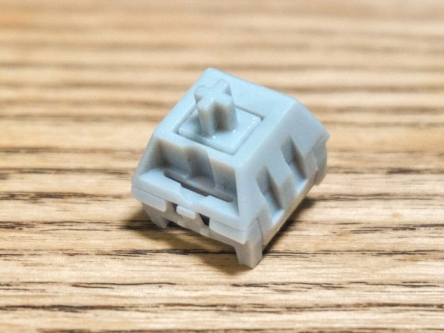
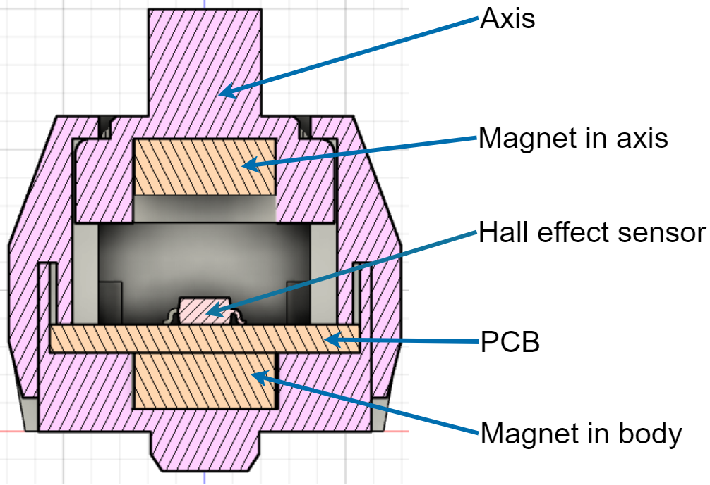
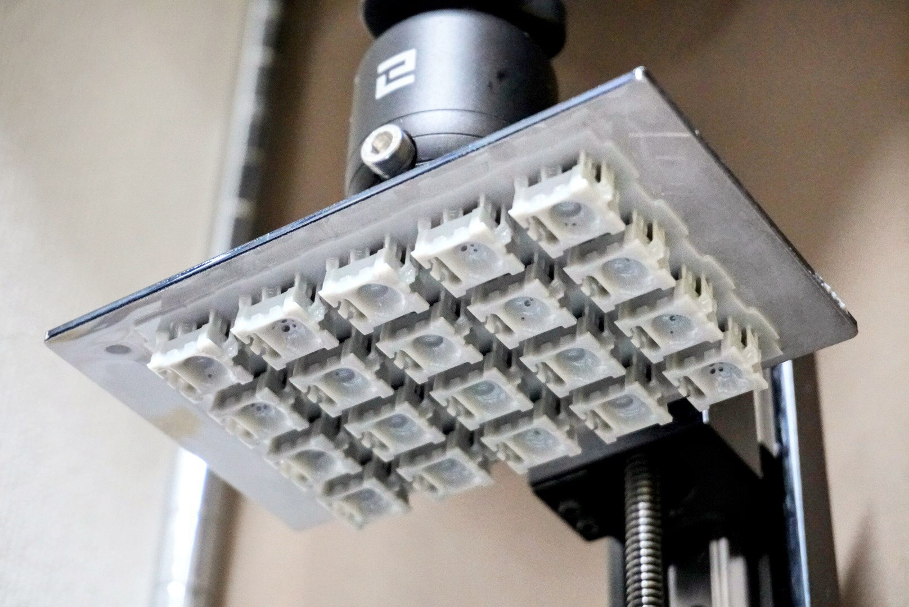
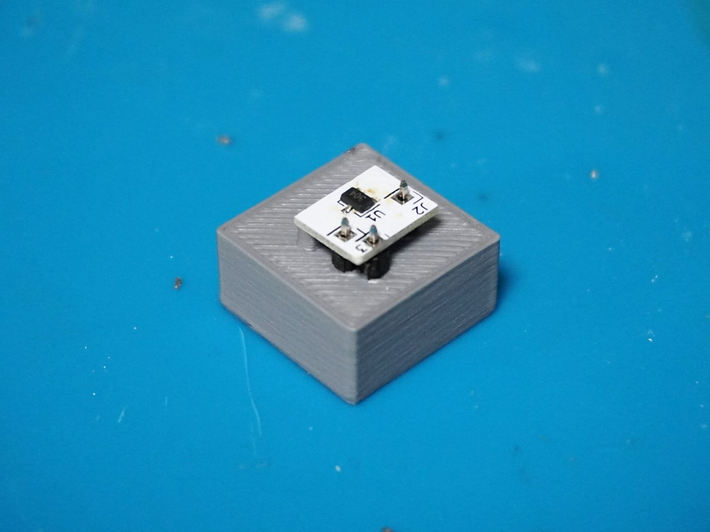
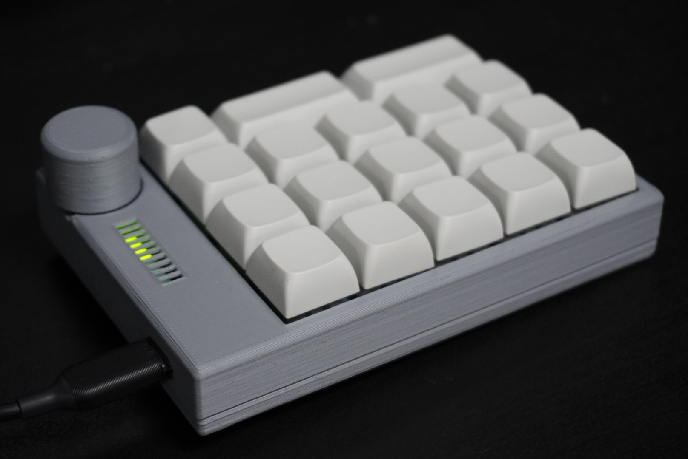

# MagLev Switch MX

## Summary
These 3D printable switches have linear output hall effect sensors with magnetic levitation switches. The shape of this swich is compatable with the Cherry MX switch.

## Features
- Magnetic levitation axis
- Non-contact switch
- Linear output(adjustable actuation depth)
- Able to make with only 2 magnets and a hall sensor.
- Compatible shape with Cherry MX switch

## Structure
Most MagLev switches don't use hall effect sensors. I think this is because the magnetism is too strong or the distance from the magnet is too close to for the sensor to detect. Therefore I implemented with new method that by sandwiching the hall effect sensor between two magnets instead of using springs.

When the axis is pushed, the magnetism will cancel each other out, which causes the magnetism detected by hall effect sensor to become zero. This is how this switch works.
This method made the switch smaller, allowing it to have the same shape as existing switches.

## BOM
- PCB x1
- Hall effect sensor IC A1304 x1
- Pin header connector 1x1 x3
- 5mm diameter x 2mm height magnet x2
- Axis part(3D printerd) x1
- Botton part(3D printerd) x1
- Top part(3D printerd) x1
- Soldering jig(3D printed) x1(Optional)

### About the magnet and the hall effect sensor
The dimensions of the magnet used to make these models are 5mm diameter and 2mm thickness neodymium magnets. I used [this magnet](https://www.amazon.co.jp/gp/product/B08MJH42VK/).
The hall effect sensor I used is [A1304](https://www.allegromicro.com/~/media/Files/Datasheets/A1304-Datasheet.ashx) from Allegro MicroSystems.

## 3D Printing
I recommend to use SLA or DLP printer to print the body of the switches. And the recommended printing direction is the angle at which the groove is parallel to the platform.

## PCB
The PCB of this switch is manufactuable with single layer. But I recommend a load-bearing double layer PCB. 
Pins I used are the usual pinheaders. They're easy install with this Soldering Jig included in the repositry.

# Sample Numeric Keypad

## Features
- Used Maglev Switches
- Also useable with common Cherry MX switch types.
- This keypad has an LED indicator and a volume for changing the actuation depth.

## BOM
- PCB x1
- MagLev Switch MX x18
- Seeeduino Xiao x1
- Linear(B type) 10k Ohm Rotary potentiometers x1
- Broadcom LED bar graph HDSP-4850  x1
- Case bottom(3D printed) x1
- Case plate(3D printed) x1
- Case top(3D printed) x1
- Volume cap(3D printed) x1

### PCB
If you want to make the sample numeric keypad, **you'll need to download KiCAD libraries from [Seeed Wiki](https://wiki.seeedstudio.com/Seeeduino-XIAO/#resourses)**. 
Then put the "Seeeduino XIAO KICAD" directory and the "Seeeduino XIAO KICAD.pretty" directory under the "Sample_Numeric_Keypad\PCB" directory.

# Directory configuration
- **MagLevSwitch_MX**: Files for maglev switch units.
    - **Body**: 3D printable mesh files and the editable file with Fusion 360(F3Z).
    - **PCB**: KiCad project files and KiCad libraries with 3D models.
    - **SolderingJig**: 3D printable mesh files of soldering jig for the PCB of this switch.
- **Sample_Numeric_Keypad**
    - **Case**: 3D printable mesh files.
    - **Code**: Source codes for the key matrix controller(Seeeduino Xiao with ) and LED indicator(ATmega328P)
    - **PCB**: KiCad project files(**Libraries of Seeduino XIAO is not included.**).
